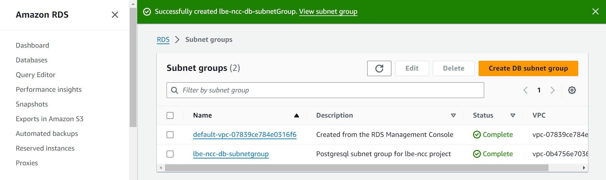
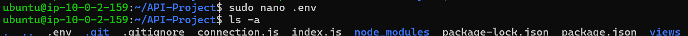

# Pertemuan 2 LBE NCC 2024

1. [Network Service AWS](#network-service-aws)
    - [Fondasi Jaringan](#fondasi-jaringan)
    - [Jaringan Aplikasi](#jaringan-aplikasi)
    - [Jaringan Edge](#jaringan-edge)
    - [Konektivitas Hibrid](#konektivitas-hibrid)
    - [Keamanan Jaringan](#keamanan-jaringan)
2. [Membangun Infrastruktur AWS Sederhana](#membangun-infrastruktur-aws-sederhana)
    - [Konfigurasi Jaringan](#konfigurasi-jaringan)
    - [Web Server](#web-server)
    - [Database](#database)
3. [Deploy Aplikasi](deploy-aplikasi)
    - [Konfigurasi Aplikasi](#konfigurasi-aplikasi)
    - [Port Forwarding pada NGINX](#port-Forwarding-pada-nginx)
    - [Menjalankan Aplikasi sebagai Layanan dengan Systemd](#menjalankan-aplikasi-sebagai-layanan-dengan-systemd)

## Network Service AWS
AWS (Amazon Web Services) menawarkan berbagai network service (layanan jaringan) yang direncang untuk  menyediakan infrastruktur jaringan yang aman, scalable, dan fleksibel bagi pengguna untuk menghubungkan, mengelola, dan mengamankan sumber daya mereka di cloud.
## Daftar Network Service AWS
### Fondasi Jaringan
#### 1. Amazon Virtual Private Cloud (Amazon VPC)
Amazon VPC memungkinkan pengguna untuk membuat jaringan virtual di dalam AWS yang terisolasi dari jaringan lain. Pengguna dapat mendefinisikan ruang alamat IP, subnet, tabel routing, dan gateway jaringan untuk mengontrol lalu lintas yang masuk dan keluar. Amazon VPC memungkinkan pengaturan yang aman untuk menjalankan sumber daya AWS dalam lingkungan yang sepenuhnya terpisah.


- Virtual Private Cloud (VPC) vs Private Cloud:
  - Virtual Private Cloud (VPC) adalah jaringan virtual yang berjalan di dalam infrastruktur cloud publik yang disediakan oleh penyedia layanan, dalam hal ini AWS. Pengguna (tenant) membuat dan mengelola VPC mereka sendiri di atas cloud publik, seperti AWS, dengan kontrol penuh terhadap lingkungan jaringan virtual mereka.
  - Private Cloud adalah infrastruktur cloud yang dimiliki dan dioperasikan oleh sebuah organisasi, di mana semua sumber daya fisik dan virtual disediakan dan dikelola secara eksklusif oleh organisasi itu sendiri. Dalam private cloud, unit bisnis organisasi tersebut bertindak sebagai tenant, dan perusahaan IT internal adalah penyedia layanannya.

#### 2. AWS Transit Gateway
AWS Transit Gateway memungkinkan pengguna untuk menghubungkan beberapa VPC dan jaringan on-premises ke dalam satu gateway pusat. Ini mempermudah pengelolaan dan skala jaringan yang besar, mengurangi kompleksitas routing, dan meningkatkan efisiensi jaringan. Transit Gateway mendukung konektivitas yang aman dan efisien antar wilayah AWS (AWS Regions).


#### 3. AWS PrivateLink
AWS PrivateLink memungkinkan layanan yang di-host di AWS, seperti Amazon S3 atau layanan pengguna yang berjalan pada Amazon ECS, diakses secara aman melalui VPC endpoint tanpa harus melalui internet publik. PrivateLink meningkatkan keamanan dengan meminimalkan eksposur data dan mengurangi risiko serangan.


### Jaringan Aplikasi
#### 1. AWS VPC Lattice
Amazon VPC Lattice adalah layanan jaringan aplikasi yang secara konsisten menghubungkan, memantau, dan mengamankan komunikasi antarlayanan Anda, dengan membantu meningkatkan produktivitas sehingga developer Anda dapat berfokus membangun fitur yang penting bagi bisnis Anda. Anda dapat menentukan kebijakan manajemen lalu lintas jaringan, akses, serta pemantauan untuk menghubungkan layanan komputasi dengan cara yang sederhana dan konsisten di seluruh instans, kontainer, dan aplikasi nirserver.


#### 2. AWS App Mesh
AWS App Mesh adalah mesh layanan yang menyediakan jaringan tingkat aplikasi untuk mempermudah layanan Anda berkomunikasi satu sama lain di beberapa tipe infrastruktur komputasi. App Mesh memberikan visibilitas menyeluruh dan ketersediaan yang tinggi untuk aplikasi.

Aplikasi modern biasanya terdiri dari beberapa layanan. Setiap layanan dapat dibuat menggunakan beberapa tipe infrastruktur komputasi, seperti Amazon EC2, Amazon ECS, Amazon EKS, dan AWS Fargate. Seiring bertambahnya jumlah layanan dalam aplikasi, menjadi sulit untuk menunjukkan dengan tepat lokasi kesalahan, merutekan ulang lalu lintas setelah kegagalan, dan men-deploy perubahan kode secara aman. Sebelumnya, Anda diharuskan untuk membangun logika pemantauan dan kontrol secara langsung ke dalam kode Anda dan men-deploy kembali layanan Anda setiap kali ada perubahan.


#### 3. AWS API Gateaway
Amazon API Gateway adalah layanan yang dikelola secara penuh yang memudahkan pengembang untuk membuat, menerbitkan, memelihara, memantau, dan mengamankan API pada segala skala. API bertindak sebagai "pintu depan" bagi aplikasi untuk mengakses data, logika bisnis, atau fungsi dari layanan backend Anda. Dengan menggunakan API Gateway, Anda dapat membuat API RESTful dan API WebSocket yang memungkinkan aplikasi berkomunikasi dua arah secara real time. API Gateway mendukung beban kerja terkontainer dan tanpa server, serta aplikasi web.

API Gateway menangani semua tugas yang terlibat dalam penerimaan dan pemrosesan hingga ratusan ribu panggilan API secara bersamaan, termasuk pengelolaan lalu lintas, dukungan CORS, otorisasi dan kontrol akses, pembatasan, pemantauan, dan pengelolaan versi API. API Gateway tidak memiliki biaya minimum atau uang muka. Anda membayar panggilan API yang Anda terima dan jumlah data yang ditransfer keluar, dan dengan model harga bertingkat API Gateway, Anda dapat mengurangi biaya saat penggunaan API diskalakan.


#### 4. AWS Cloud Map
AWS Cloud Map adalah layanan penemuan sumber daya cloud. Dengan Cloud Map, Anda dapat menentukan nama kustom untuk sumber daya aplikasi Anda, dan layanan ini akan mengelola lokasi terbaru dari sumber daya yang berubah secara dinamis. Layanan ini akan meningkatkan ketersediaan aplikasi Anda karena layanan web Anda selalu menemukan lokasi terbaru dari sumber dayanya.


#### 5. Elastic Load Balancing (ELB)
Elastic Load Balancing mendistribusikan lalu lintas aplikasi secara otomatis di beberapa target, seperti instance Amazon EC2, container, alamat IP, dan fungsi Lambda, untuk memastikan aplikasi tetap tersedia dan dapat diskalakan. AWS menawarkan tiga jenis load balancer: Application Load Balancer, Network Load Balancer, dan Gateway Load Balancer.


### Jaringan Edge
#### 1. Amazon CloudFront
Amazon CloudFront adalah layanan Content Delivery Network (CDN) yang mengantarkan konten (seperti situs web, video, aplikasi, dan API) dengan latensi rendah dan kecepatan tinggi. CloudFront menggunakan jaringan edge locations di seluruh dunia untuk menyimpan salinan konten yang sering diakses dekat dengan lokasi pengguna, yang mempercepat waktu pemuatan dan mengurangi beban server asli.


#### 2. Amazon Route 53
Amazon Route 53 adalah layanan Domain Name System (DNS) web yang sangat tersedia dan dapat diskalakan. Layanan ini mengarahkan pengguna akhir ke aplikasi internet dengan cara yang paling andal dan efisien, menggunakan jaringan global AWS untuk memastikan kecepatan resolusi yang cepat dan tingkat ketersediaan yang tinggi.


#### 3. AWS Global Accelerator
AWS Global Accelerator meningkatkan kinerja aplikasi global dengan memanfaatkan jaringan AWS global. Layanan ini menyediakan endpoint statis yang memudahkan distribusi trafik aplikasi ke berbagai wilayah geografis berdasarkan kondisi jaringan real-time, sehingga mengurangi latensi dan meningkatkan kecepatan aplikasi bagi pengguna di seluruh dunia.


### Konektivitas Hibrid
#### 1. AWS Direct Connect
AWS Direct Connect menyediakan koneksi jaringan pribadi yang aman dan performa tinggi antara pusat data pengguna dan AWS. Layanan ini memungkinkan transfer data yang lebih cepat dengan latensi rendah dan lebih konsisten dibandingkan koneksi internet publik. Direct Connect juga mendukung berbagai opsi bandwidth yang dapat disesuaikan dengan kebutuhan bisnis.


#### 2. AWS Site-to-site VPN
AWS Site-to-Site VPN adalah layanan terkelola penuh yang menciptakan koneksi aman antara pusat data atau kantor cabang Anda dengan sumber daya AWS Anda dengan menggunakan terowongan Keamanan IP (IPSec). Saat menggunakan Site-to-Site VPN, Anda dapat terhubung baik ke Cloud Privat Virtual (VPC) maupun AWS Transit Gateway Anda, dan dua terowongan per koneksi digunakan untuk meningkatkan redundansi.

Untuk aplikasi yang didistribusikan secara global, opsi Accelerated Site-to-Site VPN memberikan kinerja yang lebih besar dengan bekerja sama dengan AWS Global Accelerator untuk mengarahkan lalu lintas Anda secara cerdas ke titik akhir jaringan AWS terdekat dengan kinerja terbaik.

#### 3. VPN Klien
VPN Klien AWS adalah solusi VPN akses jarak jauh terkelola penuh yang dapat digunakan oleh karyawan di lokasi yang jauh untuk mengakses sumber daya dengan aman baik dalam jaringan bisnis AWS maupun on-premise Anda. Karena bersifat sepenuhnya elastis, VPN Klien AWS secara otomatis menaikkan atau menurunkan skala sesuai permintaan. Saat memigrasikan aplikasi ke AWS, pengguna Anda akan mengaksesnya dengan cara yang sama seperti sebelum, selama, dan setelah migrasi. VPN Klien AWS, termasuk klien perangkat lunak, mendukung protokol OpenVPN.

#### 4. WAN AWS Cloud
AWS Cloud WAN menyediakan dasbor pusat untuk membuat koneksi antara kantor cabang, pusat data, dan Amazon Virtual Private Clouds (Amazon VPC) Anda—membangun jaringan global hanya dengan beberapa klik. Anda menggunakan kebijakan jaringan untuk mengotomatiskan manajemen jaringan dan tugas keamanan di satu lokasi. Cloud WAN menghasilkan tampilan lengkap jaringan on-premise dan AWS Anda untuk membantu memantau kondisi, keamanan, dan performa jaringan.


### Keamanan Jaringan
#### 1. AWS Shield
AWS Shield adalah layanan perlindungan DDoS terkelola yang menjaga aplikasi yang berjalan di AWS.


#### 2. AWS WAF
AWS WAF membantu melindungi Anda dari eksploit web umum dan bot yang dapat memengaruhi ketersediaan, mengancam keamanan, atau menghabiskan sumber daya secara berlebihan.


#### 3. AWS Network Firewall
AWS Network Firewall adalah firewall jaringan yang terkelola yang dapat digunakan untuk mengontrol lalu lintas masuk dan keluar dari VPC berdasarkan aturan yang telah ditentukan. Ini mencakup fitur filtering konten, deteksi intrusi, dan pencegahan serangan yang dapat dikustomisasi untuk memenuhi persyaratan keamanan khusus.


#### 4. AWS Firewall Manager
AWS Firewall Manager adalah layanan manajemen keamanan yang memungkinkan Anda mengonfigurasi dan mengelola aturan firewall secara terpusat di seluruh akun dan aplikasi Anda di AWS Organizations. Saat aplikasi baru dibuat, Firewall Manager mempermudah pengguna untuk membawa aplikasi dan sumber daya baru ke dalam kepatuhan dengan memberlakukan seperangkat aturan keamanan umum.


## Membangun Infrastruktur AWS Sederhana
Setelah mengetahui berbagai macam layanan pada AWS, kita akan mencoba membuat infrastruktur AWS sederhana. Infrastruktur ini terdiri dari web server yang berada di public subnet dan database yang berada di private subnet. Agar database dapat diakses oleh web server, kita akan menambahkan route table yang mengatur lalu lintas jaringan antara public subnet dengan private subnet. Konfigurasi security group dan network ACL juga perlu dilakukan agar hak akses masing-masing resource sesuai dengan yang dibutuhkan. Struktur infrasturktur dapat lebih jelas dilihat pada ilustrasi berikut:<br>
<center>

</center>

### Konfigurasi Jaringan
#### VPC
Sebelum meluncurkan ec2 untuk web server dan rds, kita perlu membuat vpc beserta subnet yang diperlukan. Hal tersebut dapat dilakukan dengan mengakses VPC dashboard pada AWS console. Selanjutnya, anda dapat menekan tombol "Create VPC" seperti pada gambar berikut:<br>
<center>

</center>

Pada halaman pembuatan VPC, pilih "VPC and more" lalu masukkan nama project seperti pada layar berikut:<br>
<center>

</center>

Selanjutnya, pilih `2` pada jumlah availibility zone, jumlah public subnet, dan jumlah private subnet. Pilih `None` pada VPC endpoints serta biarkan pilihan lainnya.<br>
<center>

</center>

#### Auto-assign Public IPv4 pada Public Subnet
Setelah VPC terbuat, kita perlu mengaktifkan `auto-assign public IPv4` pada public subnet. Dengan begitu, web server yang nantinya diletakkan pada public subnet dapat diakses melalui internet.<br>
<center>

</center>
<center>

</center>
<center>

</center>

#### Mengatur route table utama
Secara default, route table utama akan terbuat ketika kita membuat VPC. Namun, kita akan menjadikan `lbe-ncc-rtb-public` sebagai route table utama kita. Karenanya, pilih `lbe-ncc-rtb-private` pada pilihan route table lalu klik `Actions > Set main route table`.<br>
<center>

</center>

### Web Server
Web server merupakan perangkat yang menyediakan konten web pada pengguna melalui internet. Kali ini, kita akan menggunakan `linux ec2` dan `Nginx` sebagai web server.

#### Launch instance ec2
Launch instance ec2 dapat dilakukan seperti pada pertemuan 1. Masukkan `webServer-ec2` sebagai nama instance dan pilih `Ubuntu` sebagai os image. Pada `Network Settings`, pilih vpc yang telah kita buat `lbe-ncc-vpc` dan `subnet public`.
<center>

</center>

Selain itu, buat pula security group untuk menerima koneksi `ssh` dan `http`.
<center>

</center>

Klik `launch instance` lalu tunggu hingga berhasil.
<center>

</center>

Jika telah berhasil, kita dapat melihat public IP web server dengan menekan instance terkait.
<center>

</center>

#### Mengakses ec2 dengan SSH
Setelah ec2 terbuat, kita dapat mengaksesnya dengan menggunakan SSH. SSH (Secure Shell) merupakan salah satu protokol jaringan yang biasa digunakan untuk memberikan `command` pada remote server. Command dasar ssh adalah `ssh username@host`, dengan username merupakan nama pengguna pada server dan host merupakan hostname atau alamat IP dari server. Selain itu, kita perlu juga menambahkan private key dengan memberikan opsi `-i <nama-file>.pem`. Berikut cara mengakses web server melalui SSH (jangan lupa berpindah ke direktori yang sama dengan file `.pem`).
<center>

</center>
<center>

</center>

#### Install dan menjalankan NGINX
Meskipun telah membuka port HTTP, kita belum dapat mengakses apapun pada browser.
<center>

</center>

Hal ini dikarenakan belum ada software yang menerima request pada port 80. Karenanya, kita membutuhkan Nginx sebagai web server yang akan menerima request dari pengguna. Untuk mengaktifkannya, kita perlu menginstal terlebih dahulu.
<center>

</center>

Selanjutnya, kita dapat mengaktifkannya dengan command `sudo systemctl start nginx` dan memeriksa status nginx dengan `sudo systemctl status nginx`.
<center>

</center>

Sekarang, kita dapat mengakses web pada browser seperti berikut:
<center>

</center>

### Database
Sebagian besar aplikasi web membutuhkan database untuk menyimpan data yang dibutuhkan. Pada kali ini, kita akan menggunakan database postgresql pada Amazon RDS.

#### Mengatur Security Group
Web server yang telah kita buat perlu berkomunikasi dengan database. Karenanya, kita perlu mengatur security group agar database dapat menerima koneksi postgresql (port 5432) dari web server, begitupun sebaliknya.
Pertama, kita perlu membuat `ncc-db-sg` melalui menu `Security Groups` pada `VPC Dashboard`. Selanjutnya, klik `Create Security Group`.
<center>

</center>

Pada halaman `Create Security Group`, masukkan nama dan deskripsi yang sesuai. Selain itu, pilih juga VPC sesuai yang telah dibuat sebelumnya.
<center>

</center>

Selanjutnya, kita perlu menambahkan aturan pada `inbound rule` untuk mengirim dan menerima koneksi postgresql (port 5432) dari/ke web server (pilih source dan destination ke security group web server, `webServer-sg`).
<center>

</center><center>

</center>

Kita juga perlu mengubah security group pada web server agar dapat menerima koneksi postgresql seperti di atas.
<center>

</center>
<center>

</center>
<center>

</center>

#### Membuat DB Subnet Group
Pada `Amazon RDS > Subnet Groups`, klik `Create DB Subnet Group`
<center>

</center>

Pada halaman `create DB Subnet Group`, masukkan nama yang sesuai dan pilih VPC sesuai dengan VPC yang telah dibuat (ncc-vpc).
<center>

</center>

Selanjutnya, pilih subnet yang sesuai dengan `private subnet`. Karena dropdown tidak menampilkan nama subnet, kalian bisa mencari id dari `private subnet`.
<center>

</center>
<center>

</center>

Klik `create` dan subnet group berhasil dibuat.
<center>

</center>

#### Launch RDS
Pertama, akses Amazon RDS dashboard dan pilih menu `Database`. Selanjutnya, klik tombol `Create Database` yang terdapat di kanan atas sebelah `Restore from S3`.
<center>

</center>

Pada halaman `Create Database`, pilih metode `Standard Create` dan opsi engine `PostgreSQL` (bukan Aurora postgreSQL compatible).
<center>

</center>

Agar mendapatkan konfigurasi yang sesuai dengan ketentuan layanan gratis, pilih `Free Tier` pada menu `Templates`.
<center>

</center>


Masukkan nama instance, username database, dan password.
<center>

</center>

Pada bagian `Connectivity`, pilih `Don't connect to an EC2 compute resource`. Selain itu, pilih vpc `lbe-ncc-vpc` dan subnet group `lbe-ncc-db-subnetgroup`
<center>

</center>

Pilih `No` pada bagian `public access` dan `db-sg` (security group yang telah dibuat) pada security group.
<center>

</center>

Klik `Create Database` dan database berhasil dibuat.
<center>

</center>

#### Mengakses database dari web server
Karena berada di 1 VPC dan kita telah mengatur security group, maka web server seharusnya dapat mengakses private IP database. Untuk mengakses, kita perlu menginstal postgresql pada web server.
<center>

</center>

Selanjutnya, kita dapat mencoba akses ke database menggunakan `psql` sesuai dengan nama host/endpoint dan portnya.
<center>

</center>
<center>

</center>
Selamat, anda telah berhasil membuat database di AWS dan mengaksesnya dari ec2.

## Deploy Aplikasi
Setelah berhasil membangun infrastruktur di AWS, kita akan mencoba melakukan deploy aplikasi. Aplikasi yang akan dideploy merupakan aplikasi CRUD sederhana dan dapat diclone dari https://github.com/arizki787/API-Project.
<center>

</center>

Pindah ke directory `API-Project` dan kita dapat melihat file-file yang terdapat pada direktori.
<center>

</center>

### Konfigurasi Aplikasi
Aplikasi yang akan dideploy merupakan aplikasi nodejs sehingga kita perlu menginstall `nodejs` dan `npm` terlebih dahulu.
<center>

</center>
<center>

</center>

Selanjutnya, buat database beserta tabelnya dengan terlebih dahulu mengakses postgresql di RDS. Buat database `school` dan tabel `student` dengan query berikut:
```R
CREATE DATABASE school;
CREATE TABLE student (
    sid VARCHAR(20),
    sname VARCHAR(100),
    uktstatus VARCHAR(15),
    alamat VARCHAR(100),
    email VARCHAR(100)
);
```
Jika berhasil, maka akan terlihat seperti ini.
<center>

</center>

Kita juga akan membuat file `.env` untuk mendefinisikan `environment variable` yang diperlukan dengan template sebagai berikut. Jangan lupa untuk mengubah `RDS EndPoint`, `RDS User`, dan `RDS Password` sesuai dengan RDS yang telah kalian buat.
```R
DB_HOST=<RDS EndPoint>
DB_USER=<RDS User>
DB_PORT=5432
DB_PASSWORD=<RDS Password>
DB_NAME=school
```
Dengan menggunakan `nano`, kita dapat menulis file `.env` seperti berikut. 
<center>

</center>
<center>

</center>

### Port Forwarding pada NGINX
Sebenarnya, aplikasi di atas sudah bisa dijalankan dengan command `npm start`, maka server akan mendengar pada port 3000. Namun, pada praktiknya, tidak lazim kita membuka port secara custom. Biasanya port yang dibuka untuk akses api ada pada port 80 (http) atau 443 (https). Hal tersebut sesuai dengan aturan `security group` pada instance `webServer` yang hanya menerima koneksi ke port 22 (ssh) dan 80 (http). Oleh karena itu, kita perlu melakukan port forwarding dari port 80 ke port 3000 di mana aplikasi kita berjalan.
1. Buat salinan konfigurasi server Nginx dengan command 
```R
sudo cp /etc/nginx/sites-available/default /etc/nginx/sites-available/backup
```
2. Modifikasi file `/etc/nginx/sites-available/default` dengan menggunakan `nano` menjadi sebagai berikut:
```R
server {
    listen 80;

    location / {
        proxy_set_header   X-Forwarded-For $remote_addr;
        proxy_set_header   Host $http_host;
        proxy_pass         "http://127.0.0.1:3000";
    }
}
```
3. Aktifkan konfigurasi dengan membuat symbolic link di folder `/etc/nginx/sites-enabled` dengan command berikut.
```R
sudo ln -s /etc/nginx/sites-available/default /etc/nginx/sites-enabled/
```
4. Restart Nginx dan jalankan aplikasi
```R
sudo systemctl restart nginx
node ./index.js
```
5. Akses web server pada browser, maka aplikasi kita telah dapat terlihat.
<center>

</center>

### Menjalankan Aplikasi sebagai Layanan dengan Systemd
Sebelumnya, kita perlu secara manual menjalankan aplikasi dengan command `node index.js` atau `npm start`. Namun, kita tidak mungkin dapat menjalankan server setiap saat. Oleh karena itu, kita perlu menjalankan aplikasi di latar belakang sebagai suatu layanan. Dengan demikian, aplikasi pada server dapat tetap berjalan dan dapat diakses kapanpun. Hal ini dapat dilakukan dengan mudah di linux dengan menggunakan `systemd`.
1. Buat systemd file dengan `sudo nano /lib/systemd/system/server.service`, lalu isi sebagai berikut. Jangan lupa untuk mengubah `username` dan `path-to-project` sesuai dengan server masing-masing.
```R
[Unit]
Description=Server service
After=network.target

[Service]
Type=simple
User=<username>
ExecStart=/usr/bin/node <path-to-project>
Restart=on-failure
WorkingDirectory=<path-to-project>

[Install]
WantedBy=multi-user.target
```
2. Restart daemon dan jalankan service server. Periksa juga apakah layanan server telah berjalan.
```R
sudo systemctl daemon-reload
sudo systemctl start server
sudo systemctl status server
```
3. Akses kembali public ip. Kalian akan mendapati bahwa server berjalan walaupun kalian tidak mengeksekusi npm start pada root project. Dengan demikian, project kalian sudah berjalan pada background.
